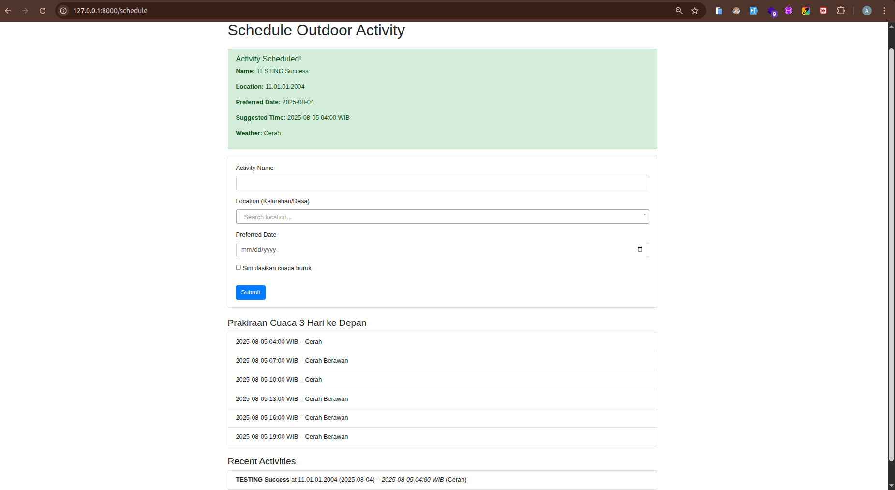
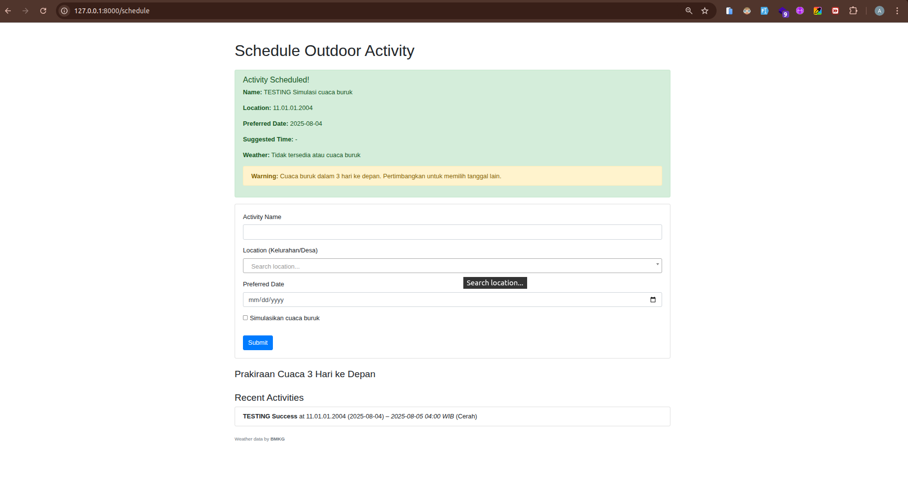

# Outdoor Activity Scheduler

A simple internal web application to schedule outdoor activities and check weather conditions using the BMKG API.

---

## Features

- Live search for village/sub-district (kelurahan/desa) using Select2
- Schedule outdoor activities based on preferred date and location
- Automatically suggests the best time slot (clear/cloudy) using BMKG weather data
- Displays 3-day weather forecast and warning if all days have bad weather
- Shows a list of recently scheduled activities

---

## Tech Stack

- Laravel 12
- PHP 8.2+
- MySQL 
- BMKG Weather API
- Bootstrap 4 (for styling)
- jQuery and Select2

---

## Screenshot

